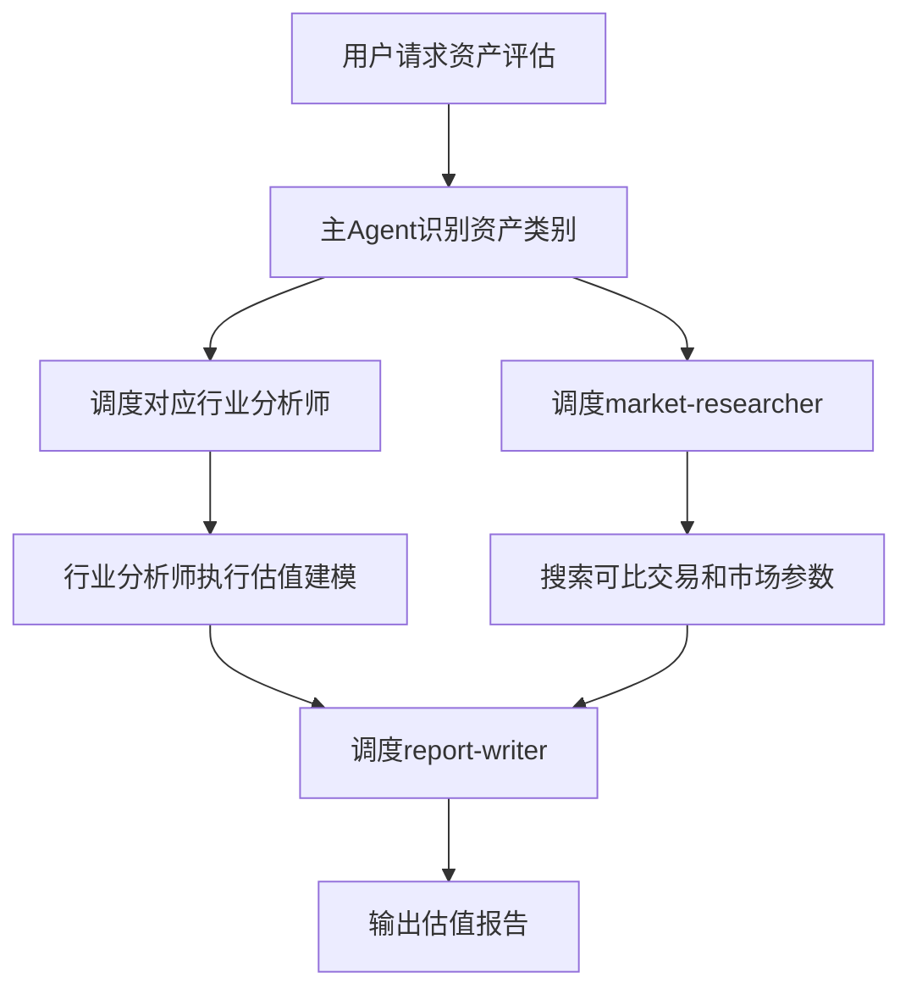
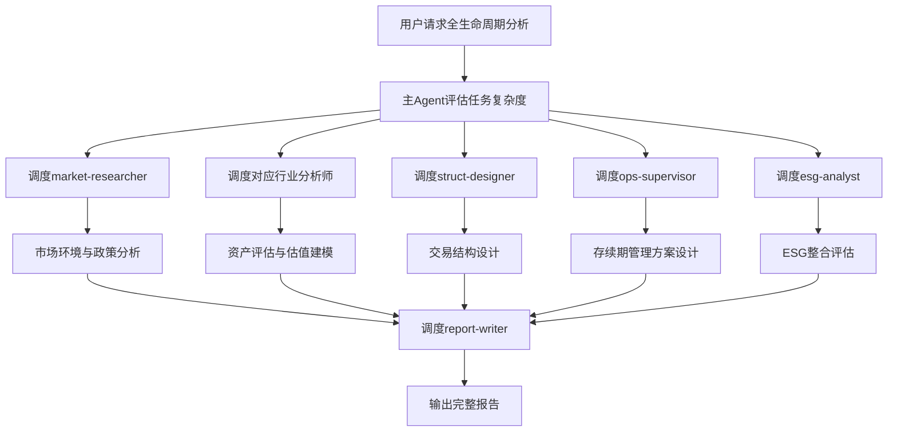

# OpenClaw REITs Expert System Code Wiki

## 1. 项目概述

OpenClaw REITs Expert System是一个基于[OpenClaw](https://github.com/openclaw)框架构建的多Agent专家系统，专注于中国公募REITs（房地产投资信托基金）及不动产证券化领域的全生命周期管理。

- **系统定位**：专业的REITs及不动产证券化多Agent专家系统
- **核心价值**：提供从资产端研判、Pre-REITs培育、交易结构设计、发行定价到存续期管理、扩募退出的全生命周期管理能力
- **技术架构**：基于OpenClaw多Agent框架，采用主从架构设计

## 2. 系统架构

### 2.1 整体架构

系统采用主Agent + 子Agent的分层架构，形成一个完整的REITs专业服务生态系统：

```
┌─────────────────────────────────────────────────────┐
│              Gateway / User Interface                │
└────────────────────┬────────────────────────────────┘
                     │
┌────────────────────▼────────────────────────────────┐
│              reits-expert (Master)                   │
│    REITs Senior Expert · Central Orchestrator       │
└──────┬─────┬─────┬─────┬─────┬─────┬─────┬─────┬───┘
       │     │     │     │     │     │     │     │
┌──────▼──┐ ┌▼────┐ ┌▼────┐ ┌▼────┐ ┌▼────┐ ┌▼────┐
│energy   │ │utility│ │transport│ │property│ │housing│
│-analyst │ │-analyst│ │-analyst │ │-analyst│ │-analyst│
└─────────┘ └──────┘ └───────┘ └───────┘ └───────┘
       │     │     │     │     │
┌──────▼─────▼─────▼─────▼─────▼─────────────────────┐
│     ops-supervisor · struct-designer               │
│     market-researcher · esg-analyst                │
│              report-writer                         │
└────────────────────────────────────────────────────┘
```

### 2.2 核心组件

| 组件类型 | 数量 | 主要职责 | 代表Agent |
|---------|------|---------|-----------|
| 主Agent | 1 | 任务分解、资产分类、子Agent调度、结果整合 | reits-expert |
| 行业垂直分析师 | 5 | 特定行业资产分析与估值 | energy-asset-analyst, utility-asset-analyst, transport-asset-analyst, property-asset-analyst, housing-asset-analyst |
| 功能型子Agent | 5 | 专业领域服务 | ops-supervisor, struct-designer, market-researcher, esg-analyst, report-writer |

## 3. 目录结构

项目采用模块化设计，每个Agent都有独立的工作空间，包含身份定义和编排规则：

```
openclaw-reits-expert/
├── README.md                              # 项目说明文档
├── install.sh                             # Linux/macOS安装脚本
├── install.ps1                            # Windows安装脚本
├── LICENSE                                # 许可证文件
├── .gitignore                             # Git忽略文件
├── docs/                                  # 文档目录
│   ├── OpenClaw_REITs专家系统配置指令.md    # 配置指南
│   └── REITs资深专家身份设定.md            # 专家身份说明
├── workspace-reits-expert/                # 主Agent工作空间
│   ├── SOUL.md                            # 身份与能力定义
│   └── AGENTS.md                          # 子Agent编排规则
├── workspace-energy-asset-analyst/        # 能源资产分析师
│   ├── SOUL.md
│   └── AGENTS.md
├── workspace-utility-asset-analyst/       # 公用事业资产分析师
│   ├── SOUL.md
│   └── AGENTS.md
├── workspace-transport-asset-analyst/     # 交通物流资产分析师
│   ├── SOUL.md
│   └── AGENTS.md
├── workspace-property-asset-analyst/      # 不动产资产分析师
│   ├── SOUL.md
│   └── AGENTS.md
├── workspace-housing-asset-analyst/       # 租赁住房资产分析师
│   ├── SOUL.md
│   └── AGENTS.md
├── workspace-ops-supervisor/              # 运营督导师
│   ├── SOUL.md
│   └── AGENTS.md
├── workspace-struct-designer/             # 结构设计师
│   ├── SOUL.md
│   └── AGENTS.md
├── workspace-market-researcher/           # 市场研究员
│   ├── SOUL.md
│   └── AGENTS.md
├── workspace-esg-analyst/                 # ESG分析师
│   ├── SOUL.md
│   └── AGENTS.md
└── workspace-report-writer/               # 报告撰写师
    ├── SOUL.md
    └── AGENTS.md
```

## 4. 核心模块与功能

### 4.1 主Agent (reits-expert)

**角色定位**：REITs资深专家，系统的总控调度中枢

**核心功能**：
- 任务复杂度评估（简单/中等/复杂）
- 资产类别识别与分类
- 子Agent团队组建与任务分配
- 结果回收与整合
- 合规风控终审

**关键能力**：
- 全生命周期管理逻辑（发行前→存续期→退出）
- 三层市场视角（私募市场→公募市场）
- 存续期管理专项能力（现金流监控、运营督导、风险预警等）
- 合规风控框架（证监会/交易所、发改委、会计/税务等法规）

**调度策略**：
- 简单任务：直接回答
- 中等任务：调度1-2个相关子Agent并行执行
- 复杂任务：组建完整子Agent团队，并行+串行结合

### 4.2 行业垂直分析师

#### 4.2.1 能源资产分析师 (energy-asset-analyst)

**覆盖资产**：风电、光伏、水电、燃气发电、储能

**核心能力**：
- 资产洞察：盈利模式分析、成本结构识别、生命周期评估
- 估值建模：DCF估值、市场比较法、敏感性分析
- 关键指标：利用小时数、电价水平、补贴依赖度、弃风/弃光率

**估值框架**：
- 发电量预测（基于风资源评估、太阳辐射数据等）
- 电价假设（电网平价项目、补贴项目）
- 补贴回收风险建模
- OPEX/Capex明细拆分
- 贴现率与永续增长率设定

#### 4.2.2 公用事业资产分析师 (utility-asset-analyst)

**覆盖资产**：供水、污水、供热、供气、垃圾焚烧发电

**核心能力**：
- 公用事业资产洞察
- 特许经营权估值
- 监管政策分析

#### 4.2.3 交通物流资产分析师 (transport-asset-analyst)

**覆盖资产**：高速公路、地铁/轨道交通、港口、物流仓储

**核心能力**：
- 交通物流资产洞察
- 流量驱动估值
- 运营效率分析

#### 4.2.4 不动产资产分析师 (property-asset-analyst)

**覆盖资产**：产业园区、数据中心、购物中心、办公楼、酒店

**核心能力**：
- 不动产资产洞察
- 空间租赁估值
- 租户结构分析

#### 4.2.5 租赁住房资产分析师 (housing-asset-analyst)

**覆盖资产**：保障性租赁住房、长租公寓

**核心能力**：
- 租赁住房资产洞察
- 政策约束估值
- 租赁市场分析

### 4.3 功能型子Agent

#### 4.3.1 运营督导师 (ops-supervisor)

**核心能力**：
- 运营督导：KPI考核体系设计、运营报告评估
- 存续期管理：现金流监控、账户监管
- 风险预警：三级预警机制、关键预警指标体系
- 触发事件应对：差额支付/担保履约、资产处置/回购决策

#### 4.3.2 结构设计师 (struct-designer)

**核心能力**：
- 交易结构设计：SPV设立、股债比设计、信用增级方案
- 税务筹划：资产重组税务处理、SPV税务架构
- 扩募退出：扩募方案设计、退出路径规划

#### 4.3.3 市场研究员 (market-researcher)

**核心能力**：
- 市场解读：行业趋势分析、投资者偏好研究
- 法规应用：监管政策解读、合规要求分析
- 可比交易研究：市场参数收集、案例分析

#### 4.3.4 ESG分析师 (esg-analyst)

**核心能力**：
- ESG整合：环境、社会、治理因素评估
- 绿色资产识别：绿色债券/绿色REITs认证
- ESG报告编制：符合国际标准的ESG报告

#### 4.3.5 报告撰写师 (report-writer)

**核心能力**：
- 成果格式化：专业报告撰写、文档排版
- 多格式输出：Word、PowerPoint、PDF、Excel
- 可视化呈现：图表设计、数据可视化

## 5. 核心流程与调用关系

### 5.1 任务处理流程

1. **任务接收与分析**：主Agent接收用户请求，评估任务复杂度，识别资产类别
2. **子Agent调度**：根据任务类型和资产类别，选择合适的子Agent组合
3. **并行执行**：子Agent并行处理各自任务
4. **结果回收**：主Agent回收所有子Agent的执行结果
5. **质量审核**：主Agent对结果进行交叉验证和质量审核
6. **整合输出**：将结果整合成结构化输出，添加风险提示和实操建议

### 5.2 典型调用场景

#### 场景1：资产评估类任务



#### 场景2：全生命周期综合分析



## 6. 关键API与工具

### 6.1 核心API

- **sessions_spawn**：用于调度子Agent执行任务
  - 参数：agentId（子Agent ID）、task（任务描述）
  - 返回：子Agent执行结果

### 6.2 可用Skill工具

| Skill名称 | 功能描述 | 适用Agent |
|---------|---------|----------|
| financial-analyst | 财务比率分析、DCF估值、WACC计算 | 所有资产分析师、struct-designer |
| financial-operations-expert | 现金流管理、运营分析、风险预警 | ops-supervisor |
| financial-deep-research | 多源金融数据深度研究 | market-researcher |
| stock-research-executor | 行业投资研究、上市公司分析 | market-researcher |
| startup-financial-modeling | 财务预测建模、多情景分析 | 所有资产分析师 |
| web-search | 搜索市场数据、政策文件 | market-researcher、esg-analyst |
| research-paper-writer | 撰写专题研究报告 | esg-analyst |
| docx | 生成Word文档 | report-writer、struct-designer |
| pptx | 生成PowerPoint演示文稿 | report-writer |
| pdf | 生成PDF文档 | report-writer |
| xlsx | 生成Excel表格、构建估值模型 | 所有资产分析师、ops-supervisor |

## 7. 配置与部署

### 7.1 系统要求

- OpenClaw框架已安装并配置
- Git（用于克隆仓库）

### 7.2 安装方法

#### 方法1：快速安装（推荐）

```bash
git clone https://github.com/YOUR_USERNAME/openclaw-reits-expert.git
cd openclaw-reits-expert
chmod +x install.sh
./install.sh
```

#### 方法2：手动安装

1. 克隆仓库：
   ```bash
   git clone https://github.com/YOUR_USERNAME/openclaw-reits-expert.git
   cd openclaw-reits-expert
   ```

2. 复制工作空间到OpenClaw：
   ```bash
   # Linux/macOS
   cp -r workspace-* ~/.openclaw/
   
   # Windows PowerShell
   Copy-Item -Path "workspace-*" -Destination "$env:USERPROFILE\.openclaw\" -Recurse -Force
   ```

3. 注册所有Agent：
   ```bash
   openclaw agents add reits-expert --workspace ~/.openclaw/workspace-reits-expert
   openclaw agents add energy-asset-analyst --workspace ~/.openclaw/workspace-energy-asset-analyst
   # 注册其他Agent...
   ```

4. 配置主Agent权限：
   ```bash
   openclaw config set agents.list[0].subagents.allowAgents '["energy-asset-analyst","utility-asset-analyst","transport-asset-analyst","property-asset-analyst","housing-asset-analyst","ops-supervisor","struct-designer","market-researcher","esg-analyst","report-writer"]' --json
   ```

5. 配置路由：
   ```bash
   openclaw config set bindings '[{"agentId": "reits-expert", "match": {}}]' --json
   ```

### 7.3 验证安装

```bash
# 列出所有Agent
openclaw agents list

# 检查网关状态
openclaw gateway status

# 测试简单查询
openclaw chat --agent reits-expert
# 输入："请对某10万千瓦风电项目进行估值分析"
```

## 8. 使用指南

### 8.1 基本使用

1. **启动对话**：
   ```bash
   openclaw chat --agent reits-expert
   ```

2. **输入问题**：根据需要输入REITs相关问题，如：
   - "请对某10万千瓦风电项目进行估值"
   - "我有一个产业园项目拟申报公募REITs，请出具完整方案"
   - "如何建立REITs项目的现金流监控体系"

3. **查看结果**：系统会自动分析问题，调度相关子Agent，并返回结构化的分析结果

### 8.2 高级使用

#### 资产估值分析

**示例输入**：
```
请对某10万千瓦陆上风电项目进行估值分析，项目位于内蒙古，设计利用小时数2200h，上网电价0.45元/kWh，补贴占比30%，运营成本0.04元/kWh，建设期1年，运营期20年。
```

**系统处理**：
1. 主Agent识别为能源类资产，调度energy-asset-analyst
2. 并行调度market-researcher搜索风电资产可比交易
3. energy-asset-analyst执行DCF估值，考虑补贴回收风险
4. report-writer整合输出估值报告

#### 全生命周期方案

**示例输入**：
```
我有一个位于上海的产业园项目，建筑面积5万平方米，出租率90%，年均租金80元/平方米/月，拟申报公募REITs，请出具完整的发行方案。
```

**系统处理**：
1. 主Agent识别为不动产类资产，评估为复杂任务
2. 调度market-researcher进行市场环境与政策分析
3. 调度property-asset-analyst进行资产评估与估值建模
4. 调度struct-designer设计交易结构
5. 调度ops-supervisor设计存续期管理方案
6. 调度esg-analyst进行ESG整合评估
7. 调度report-writer汇总输出完整报告

## 9. 风险与限制

### 9.1 合规风险

- **合规风控红线**：以下事项必须由主Agent终审，不得委托子Agent：
  1. 投资者适当性判断
  2. 关联交易识别与披露
  3. 评级下调应对决策
  4. 持有人大会召集条件判断
  5. 税务合规判断
  6. 法律条款深度排查
  7. 信息披露合规判断
  8. 资产处置/回购决策
  9. 扩募投资标的选择
  10. 公募REITs发行方案中的公众投资者保护条款

### 9.2 数据质量风险

- **数据分级标注**：系统要求所有数据来源进行分级标注：
  - A级：可核实的公开数据（可信度最高）
  - B级：行业基准或可比项目数据（可信度较高）
  - C级：专家判断或内部估算（必须标注「估算」）
- **执行规则**：A级数据占比不低于60%，C级数据占比不超过20%

### 9.3 系统限制

- **资产类别识别**：当资产描述不明确时，系统会向用户追问具体资产类型
- **跨行业资产**：对于兼具多行业特征的资产，系统会根据核心盈利模式进行分类
- **信息完整性**：在信息不完整时，系统会基于行业基准假设进行估算，并明确标注

## 10. 总结与亮点回顾

### 10.1 系统亮点

1. **专业深度**：覆盖REITs全生命周期，具备行业垂直细分能力
2. **智能调度**：基于资产类别和任务复杂度的智能子Agent调度
3. **全周期视角**：不仅关注发行环节，更强调存续期的动态管理
4. **合规保障**：建立了严格的合规风控框架和红线清单
5. **数据质量**：实施数据分级标注标准，确保分析结果的可靠性
6. **多格式输出**：支持Word、PowerPoint、PDF、Excel等多种输出格式

### 10.2 应用价值

- **提高效率**：自动化处理REITs相关分析任务，减少人工成本
- **专业赋能**：为REITs从业者提供专业分析工具和决策支持
- **风险防控**：建立风险预警机制，提前识别和应对潜在风险
- **标准化输出**：提供结构化、标准化的分析报告，提升专业度

### 10.3 未来发展

- **扩展资产类别**：增加更多细分行业的资产分析能力
- **增强预测能力**：引入机器学习模型，提升预测准确性
- **实时数据集成**：接入实时市场数据和政策信息
- **用户界面优化**：开发更友好的用户界面，提升用户体验

## 11. 技术支持与维护

### 11.1 故障排查

- **Agent注册失败**：检查OpenClaw配置和工作空间路径
- **子Agent调度失败**：检查子Agent权限配置和网络连接
- **估值结果异常**：检查输入参数和假设条件

### 11.2 版本管理

- **版本号**：1.0.0
- **更新周期**：根据市场和政策变化定期更新
- **向后兼容**：保持API兼容性，确保现有配置继续有效

### 11.3 联系方式

- **维护者**：ZHANGWEI232
- **更新日期**：2025-04-23
- **项目地址**：https://github.com/YOUR_USERNAME/openclaw-reits-expert

## 12. 附录

### 12.1 资产分类矩阵

| 关键词 | 对应Agent | 资产类别 |
|-------|---------|----------|
| 风电、光伏、水电、燃气发电、储能 | energy-asset-analyst | 能源类 |
| 供水、污水、供热、供气、垃圾焚烧 | utility-asset-analyst | 公用事业类 |
| 高速公路、地铁、港口、物流仓储 | transport-asset-analyst | 交通物流类 |
| 产业园、数据中心、商业、办公、酒店 | property-asset-analyst | 不动产类 |
| 保租房、长租公寓 | housing-asset-analyst | 租赁住房类 |

### 12.2 任务复杂度评估标准

| 复杂度 | 特征 | 处理方式 |
|-------|------|----------|
| 简单 | 单一问题、概念解释、快速判断 | 主Agent直接回答 |
| 中等 | 涉及1-2个专业领域 | 调度1-2个相关子Agent并行执行 |
| 复杂 | 涉及3个以上专业领域、需要深度分析报告 | 组建完整子Agent团队，并行+串行结合 |

### 12.3 数据分级标注标准

| 级别 | 定义 | 示例 |
|------|------|------|
| A级 | 可核实的公开数据，可信度最高 | 年报、募集说明书、审计报告、政府统计公报 |
| B级 | 行业基准或可比项目数据，可信度较高 | 行业协会报告、研究机构报告、Wind数据 |
| C级 | 专家判断或内部估算，必须标注「估算」 | 基于行业均值的推断、趋势外推预测 |